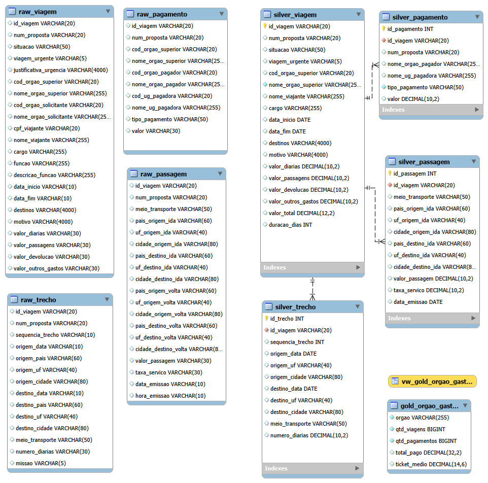
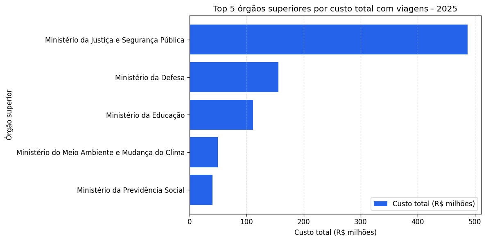
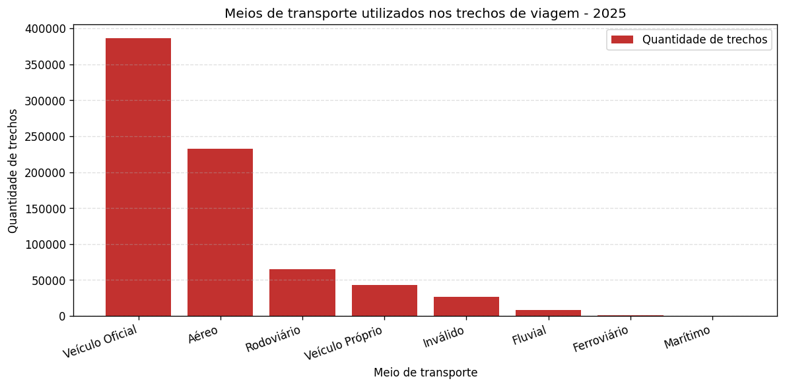

# Pipeline de Dados — Viagens a Serviço do Governo Federal

Pipeline de dados de ponta a ponta (ETL) que baixa a base de **Viagens a Serviço** do
Portal da Transparência, preserva o dado bruto, limpa e tipa as informações e entrega
métricas e gráficos prontos para a tomada de decisão, seguindo a **Arquitetura Medallion**
(Raw → Silver → Gold).

Projeto Avaliativo — Módulo 1 — Análise de Dados com Python.

---

## 1. O problema

O Portal da Transparência publica os gastos com viagens a serviço, mas os dados chegam
brutos: separador `;`, encoding `latin-1`, valores com vírgula decimal (`1272,97`), datas
em `DD/MM/AAAA` e nenhuma relação declarada entre os quatro arquivos. Nesse formato é
impossível responder perguntas simples como "qual órgão gastou mais?" sem retrabalho
manual a cada consulta.

Este pipeline resolve isso: automatiza o download, preserva o histórico original para
auditoria, converte os dados para tipos corretos com integridade referencial declarada
no banco, e materializa uma camada agregada de negócio.

**Volume processado:** 1.879.385 linhas em 4 tabelas.

| Tabela    |  Linhas |
| --------- | ------: |
| Viagem    | 341.860 |
| Pagamento | 606.916 |
| Passagem  | 167.260 |
| Trecho    | 763.349 |

---

## 2. Tecnologias e técnicas

| Categoria      | O que foi usado                                                                                                                                                                                                                        |
| -------------- | -------------------------------------------------------------------------------------------------------------------------------------------------------------------------------------------------------------------------------------- |
| Linguagens     | Python 3.12, SQL (MySQL 8)                                                                                                                                                                                                             |
| Bibliotecas    | pandas, mysql-connector-python, gdown, matplotlib, jupyter                                                                                                                                                                             |
| Arquitetura    | Medallion (Raw / Silver / Gold)                                                                                                                                                                                                        |
| Técnicas      | ETL, leitura em blocos (*chunks*), carga em lote (`executemany`), idempotência, integridade referencial (PK/FK), constraints declarativas (`NOT NULL`, `CHECK`, `UNIQUE`), tabela e VIEW agregadas, visualização de dados |
| Boas práticas | Credenciais em `.env` (fora do código), `.gitignore`, modularização (`config.py` / `banco.py`), PEP-8                                                                                                                        |

---

## 3. Arquitetura

```
  Google Drive (.zip)
          │
          ▼
   1_extrair.py ─────────►  CAMADA RAW      raw_viagem, raw_pagamento,
   download + leitura       (tudo VARCHAR)  raw_passagem, raw_trecho
   em blocos                cópia fiel do CSV
          │
          ▼
  2_transformar.py ──────►  CAMADA SILVER   silver_viagem, silver_pagamento,
  tipagem, limpeza e        (tipada, PK/FK  silver_passagem, silver_trecho
  colunas calculadas         e constraints)
          │
          ▼
  3_analise.ipynb ───────►  CAMADA GOLD     gold_orgao_gastos (tabela)
  JOIN + GROUP BY           (agregada)      vw_gold_orgao_gastos (VIEW)
  perguntas + gráficos
```

| Camada           | O que é                                                                                                                                                                                  | Onde fica                                       |
| ---------------- | ----------------------------------------------------------------------------------------------------------------------------------------------------------------------------------------- | ----------------------------------------------- |
| **Raw**    | Cópia fiel do CSV. Todas as colunas `VARCHAR`, mantendo vírgulas, datas `DD/MM/AAAA` e formatos originais. Sem constraints, para nada ser rejeitado e o histórico ficar auditável. | `raw_*`                                       |
| **Silver** | Dados limpos e tipados (`DECIMAL`, `DATE`, `INT`), com PK, FK e 2 constraints extras por tabela.                                                                                    | `silver_*`                                    |
| **Gold**   | Métricas de negócio agregadas por `JOIN` + `GROUP BY`, materializadas como tabela e como VIEW.                                                                                       | `gold_orgao_gastos`, `vw_gold_orgao_gastos` |

### Modelo relacional da Silver

`silver_viagem` é a tabela principal (`PRIMARY KEY id_viagem`). As outras três apontam
para ela por `FOREIGN KEY`:



### Constraints declaradas

| Tabela               | Constraint 1                            | Constraint 2                             |
| -------------------- | --------------------------------------- | ---------------------------------------- |
| `silver_viagem`    | `NOT NULL` em `nome_orgao_superior` | `CHECK (valor_diarias >= 0)`           |
| `silver_pagamento` | `CHECK (valor >= 0)`                  | `NOT NULL` em `tipo_pagamento`       |
| `silver_passagem`  | `CHECK (valor_passagem >= 0)`         | `CHECK (taxa_servico >= 0)`            |
| `silver_trecho`    | `CHECK (numero_diarias >= 0)`         | `UNIQUE (id_viagem, sequencia_trecho)` |

---

## 4. Estrutura do repositório

```
projeto/
├── data/                    # .zip e .csv (ignorados pelo Git)
├── scripts/                 # lógica ETL em Python
│   ├── config.py            # parâmetros + leitura do .env
│   ├── banco.py             # conexão e funções utilitárias do MySQL
│   ├── 1_extrair.py         # download + carga na camada Raw
│   ├── 2_transformar.py     # Raw → Silver (tipagem e colunas calculadas)
│   └── 3_analise.ipynb      # camada Gold: perguntas e gráficos
├── sql/                     # scripts DDL e consultas analíticas
│   ├── 0_criar_banco.sql    # database + 8 tabelas (Raw e Silver)
│   └── gold_consultas.sql   # camada Gold e perguntas em SQL puro
├── docs/                    # gráficos gerados pelo notebook
├── .env.example             # modelo de credenciais
├── .gitignore
├── requirements.txt
└── README.md
```

---

## 5. Como executar

### Pré-requisitos

- Python 3.10 ou superior
- MySQL 8.0 ou superior (o `CHECK` só é validado a partir do 8.0.16)

### Passo a passo

```bash
# 1. Clonar e instalar as dependências
git clone <url-do-repositorio>
cd <pasta-do-projeto>
pip install -r requirements.txt

# 2. Configurar as credenciais
cp .env.example .env
# edite o .env com o usuário e a senha do seu MySQL
```

```sql
-- 3. Criar o banco e as 8 tabelas
--    Abra o sql/0_criar_banco.sql no MySQL Workbench e execute tudo (Ctrl+Shift+Enter).
```

```bash
# 4. Rodar o pipeline, na ordem
cd scripts
python 1_extrair.py       # download + camada Raw
python 2_transformar.py   # camada Silver

# 5. Abrir a camada Gold
jupyter notebook 3_analise.ipynb
```

O `1_extrair.py` baixa o `.zip` do Google Drive automaticamente na primeira execução e
reaproveita o arquivo local nas seguintes. Os dois scripts são **idempotentes**: podem
ser executados quantas vezes for preciso sem duplicar registros.

---

## 6. Decisões de projeto

| Decisão                | Escolha                                                      | Motivo                                                                                                                                  |
| ----------------------- | ------------------------------------------------------------ | --------------------------------------------------------------------------------------------------------------------------------------- |
| `valor_total`         | `diárias + passagens + outros gastos − devolução`      | A devolução é dinheiro que retornou aos cofres públicos; somá-la infla o gasto real.                                               |
| `duracao_dias`        | `DATEDIFF(data_fim, data_inicio) + 1`                      | Uma viagem que começa e termina no mesmo dia dura 1 dia, não 0.                                                                       |
| Idempotência da Raw    | `TRUNCATE` antes da carga                                  | Não há FK apontando para as tabelas Raw.                                                                                              |
| Idempotência da Silver | `DELETE` na ordem filhas → principal                      | `TRUNCATE` não é permitido em tabela alvo de `FOREIGN KEY`.                                                                       |
| Campos vazios           | `NULLIF(TRIM(coluna), '')` → `NULL`                     | Distingue "não informado" de zero. Resolve as 664 datas de emissão em branco da tabela de passagens.                                  |
| Integridade nas filhas  | `WHERE id_viagem IN (SELECT id_viagem FROM silver_viagem)` | Garante que nenhum registro órfão viole a `FOREIGN KEY`.                                                                             |
| "Destino" na pergunta 2 | `destino_cidade/destino_uf` da tabela de trechos           | A coluna `destinos` da viagem é texto livre com múltiplos destinos na mesma célula.                                                 |
| Corte na pergunta 2     | `HAVING COUNT(*) >= 30`                                    | Sem o corte, o ranking de custo médio seria dominado por destinos com uma única viagem cara — um outlier, não um padrão.           |
| Categoria `Inválido`  | Mantida na Silver                                            | A Silver preserva o que existe na origem; medir o volume dessa categoria é informação útil para o órgão corrigir o preenchimento. |

---

## 7. Perguntas de negócio respondidas

Todas em `scripts/3_analise.ipynb`, cada uma com consulta SQL, tabela e gráfico.

**Direto da camada Silver**

1. Os 5 órgãos com maior custo total
2. Os 3 destinos com maior custo médio por viagem
3. A viagem de maior duração e seu custo total

**A partir da camada Gold agregada**

4. O tipo de pagamento com maior valor médio
5. O meio de transporte mais usado nos trechos
6. A UF de destino que aparece em mais trechos
7. O órgão que mais pagou no total

---

## 8. Conclusões e insights

**O gasto é muito concentrado.** Os cinco órgãos que mais gastaram somam
R$ 844,4 milhões, e só o Ministério da Justiça e Segurança Pública responde por
R$ 486,9 milhões disso — quase 58% do total dos cinco, em 75.742 viagens. Auditar
um único órgão já cobriria mais da metade do dinheiro.



**Destino caro e destino movimentado são coisas diferentes.** Monte Negro/RO tem o
maior custo médio por viagem (R$ 84.926,03, em 98 viagens), mas quem mais aparece
nos trechos é São Paulo, com 82.722. Comparando com o Distrito Federal aparece uma
diferença interessante: São Paulo tem 82.722 trechos em 46.392 viagens, quase 1,8
trecho por viagem, enquanto o DF tem 79.962 trechos em 72.297 viagens, pouco mais
de 1. São Paulo costuma ser escala; Brasília costuma ser o destino final.

**A viagem mais longa tem custo zero.** Durou 384 dias, do Ministério da Previdência
Social, contra uma média geral de 8,1 dias — e o valor total registrado é R$ 0,00.
Ou é erro de preenchimento na origem, ou a viagem foi custeada fora do sistema. Foi
o achado que mais me chamou atenção, e ele só ficou visível porque a camada Silver
tipou a data e permitiu calcular a duração.

**Diárias pesam mais que passagens, nos dois sentidos.** Diárias lideram tanto o
valor médio (R$ 2.078,28 por pagamento) quanto o total (R$ 834,4 milhões), contra
R$ 355,0 milhões de passagens. Faz sentido quando se olha o modal: veículo oficial
responde por 50,6% dos trechos e aéreo por 30,5%. Boa parte do deslocamento é
terrestre, então o custo migra da passagem para a diária.



**Um alerta de qualidade da base.** 3,5% dos trechos (26.659) têm meio de transporte
registrado como "Inválido". Preferi não filtrar: para o órgão, saber o tamanho desse
buraco de preenchimento é mais útil do que uma tabela artificialmente limpa.


---

## 9. Melhorias futuras

- **Carga incremental** por competência (mês), em vez de recarregar a base inteira a cada execução.
- **Testes automatizados de qualidade** na passagem Raw → Silver (contagem de linhas, taxa de nulos, faixas de valores), falhando o pipeline quando um limite for violado.
- **Índices** nas colunas usadas nos `JOIN` e nos `GROUP BY` (`nome_orgao_superior`, `destino_uf`), para acelerar a camada Gold.
- **Orquestração** com cron ou Airflow, com registro de execução e alerta em caso de falha.
- **Particionamento** das tabelas Raw por mês de referência, facilitando o descarte de histórico antigo.
- **Dashboard** (Power BI, Metabase ou Streamlit) lendo a camada Gold, para o usuário final não depender do notebook.


---


## Autora

**Talita Aparecida Silva Dzulinski** | Turma 2 | Módulo 1 — Análise de Dados com Python
